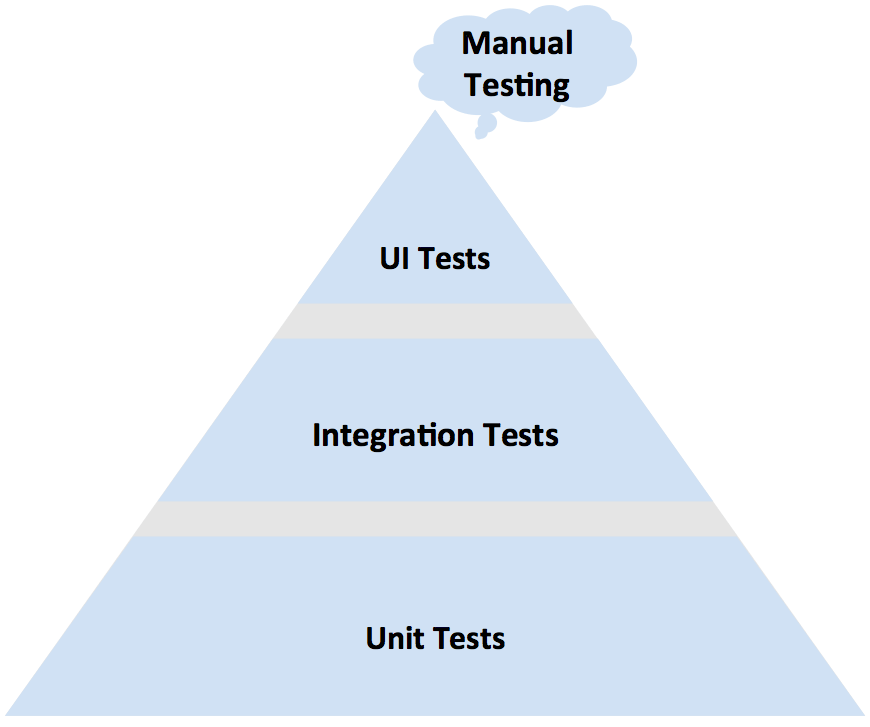

# Tasting tests at Cookpad
@Kazu_cocoa

Hello, everyone.
I'm Kazu.
Now, I'm so excited to be able to talk for many Swift and iOS developers.

Today, I talk associated with "TEST" since I'm a test engineer.
"Tasting" used in my title means taste stuff because my company is regarding with food.

# About me

At first, I introduce myself.
I'm Kazuaki Matsuo and working at Cookpad as a test engineer.
I've tried test automation for mobile and improved development processes and other many roles to improve several qualities for our services.
So, "Software Engineer in Quality" might be more suitable name to explain me in my company, I think.

I use some languages in my work such as swift, ruby, java for android and elixir.
Recently, I've maintained Appium ruby binding client library.

# 😋
go ahead

# A bunch of topics in "TEST"
Even we use the word "TEST", it has various meanings.
For example, the word has categories such as usability test and performance test and has test level such as unit test and integration test.
Today, I pick up test automation and a test pyramid which has three layers, unit test, integration test and UI test for automated test.
In addition the pyramid has manual test outside of the pyramid.

# test pyramid



The pyramid is one of a famous diagram for test automation.
This shows ideal relationship and amount for unit tests, integration tests and UI tests in development.
Unit tests deal with testing logic in code level and UI tests focus on simulate user behaviours against the test target app.
Unit tests are small and fast but UI tests aren't.

# How UI Tests support our development
Today, I focus on UI tests and how the tests support our development. I don't talk about unit level tests today.
So, you can taste UI tests and our story.
I'm happy if anyone gets the motivation to try UI tests after my talk.

# We should know about the test target if we try to tests stuff
(いまいち...)

We should learn test target if we try to understand and taste some tests not only about tools but also strategies and so on.
So, I'll explain about Cookpad and its iOS app at first to help you understand the following topics.

# What is Cookpad?


Cookpad is one of famous recipe sharing service in the world.
We have two kinds of services, for Japan and for rest of the world for now.
According to the similarweb.com, Cookpad is the largest site in the food category.

# Cookpad for iOS(Japan and Global)


We also have two kinds of iOS applications for Cookpad.
One is for Japan and another is for rest of the world.
Their service growth level is difference so we haven't merged them yet.

If anyone comes from out of Japan, you can see global app.

# Cookpad for iOS(Japan)


I focus on the Japanese app today.

# Histries for Cookpad iOS App(Japan)


The cookpad app has grown for around 5 years.
I attached some screenshots to be able to see the growth and the changes.
The app changed UI component, add or delete any features or re-write/refactor implementations during the period.

The production code also has grown and it is around 100 thousand lines except for comment, blank and new lines for now.

# Kano-model and Japan market


https://en.wikipedia.org/wiki/Kano_model

kano-model is one of the famous models to explain about quality.
There is two main quality. One is Must-be Quality and another is Attractive Quality.
Must-be quality in Japan is high because they require crash-free app as must-be quality in many cases. It is not attractive for them.

I heard this must-be quality is more rigid than other countries...

# diachronic quality in mobile app
(なくすかもしれない) <= 新しい言葉が増えるので、さらっと流す説明以上になりそうならなくす

Mobile app's environment changes frequently and OS version change every year.
UI and design also change a few years cycle. Required quality by market also has changed.

Recently, I sometimes mention such movement as diachronic quality.
This word is influenced by linguistics.
diachronic quality include many meanings, but I just mention for frequent change environment in this time.

# How often cookpad app changes

- release cycle: 2week ~ 1months
- change ui / code

In this period, Cookpad also has changed to catch up with the cycle.
Release our app every two weeks or one month to improve our service and UIs for the end users.
Seldome, We change UI significantly.
Recently, we change source code around 5,000 ~ 10,000 lines per release.

# Take a break 🍵

I talked histories of Cookpad iOS app and its changes, and diachronic quality to explain quality model which changes frequently.

# Tasting tests😋

I start talking UI Test what I've done for the environment.

# A History for UI Tests for Cookpad Apps


This repository shows a growth of UI tests I and we've implemented at Cookpad.
I've developed the environment since 2014.

# Why have we implemented this UI tests?🤔

We knew our service need to develop continuously and we should evolve apps in the future.
So, we should proceed re-engineering mobile apps.

# Should we taste from?

> Writing unit tests before refactoring is sometimes impossible and often pointless.

This sentence is quoted from "Re-Engineering Legacy Software".
It is true since we can't check behaviour without tests.

The most of the developers may agree with re-write/refactor features without tests lead unexpected broken stuff.
In addition, if we make the target app testable, we should consider architecture for the app and other many things if target app isn't testable.

On the other hand, without CI environment, it is difficult to iterate development cycle quickly without tests.

# Basic strategy

  (internal) sorce code => |app| <= (externl) users

We approached to make the app testable from two aspects, internal and external.
"Internal" means production code side.
"External" means end-user and GUI side.

# Make checkable from external to internal

check from external <=> re-write/refactor/implement from internal(and add unit tests)
図を用意する

Check if GUI/behaviour are broken from external.
And re-write/refactor/implement some features.
Developers continue to change internal code and add unit tests aggressive because if some features are obviously broken, we can uncover the bug in UI level checking.
So, we can fix the issue before release.

This kind of UI level checking is not only automated tests but also manual checking.

# Unit tests for Re-Engineering

The re-engineering also describes the following quotation.

> Most developers would agree that unit test should be fully automated,

I think most of the developers agree with this.

# Unit tests are not a silver bullet

But, it also describes as...

> but the level of automation for other kind of tests(such as integration tests) is often much lower.

Certainly, implementing tests for integration layer and UI layer is difficult than unit layer.

# UI Test should be automated

But...

> One area that cries out for automation is UI testing.
> (4.3.2. Regression testing without unit tests)

yes, automated UI testing is very important.

But...
In many cases, UI tests take too many times and too many human resources in mobile because test automation for mobile is difficult.

So, UI tests for mobile tend to conducted by manual.

# Flipped pyramid make development cycle slow


By the way, I talked ideal test pyramid for test automation before.
Unit tests is the biggest and UI tests are the smolest.
But in the mobile context, it is easy to make it flipped.

Checking UIs manually is easy than test automation.
But large manual tests take too many times blocks swift development cycle in the future.

UI tests can support re-engineering frequently.

# UI Test should be automated(again)
So, automating UI test is very importnat.

You can check most of the layouts, screen transactions without crashes and so on automatically.
You can also check combinations of various OS versions and resolutions without additional human resources.

Certainly, designing test architecture for test automaiton is also important.
Don't convert all manual tests to dirty automated tests.

# implement the strategy

# Automated UI Test with Appium from 2014

I've tried to implement UI Test since 2014, I've joined cookpad.
While conducting manual tests, I've been working on test automation step by step.
I've implemented it with Ruby :p

# Architecture for UI Tests

図にする
|シナリオ| <=> ｜操作の実装｜ <=> internal libraries <=> ruby_lib(appium ruby binding) <=> Appium <=> iOS(UIAutomation/XCUITest) <=> Cookpad App

Our architecture for the automated test is like this.
We separate some layer to divide responsibilities for scenarios associated with end-users and product code associated with the iOS framework.

I'd like to independent scenarios from the iOS side and also independent implementations from user scenarios.
(iOS側の実装と、シナリオ側の実装を分離したい)

(こうすることで、iOS側が変化した時は、シナリオは変えず、internal librariesのところだけでiOSフレームワーク側の変更を吸収します)

Thus, we can decrease maintenance costs for scenarios side and iOS side.

The separation of responsibility is familiar to developers.


# Scenarios

```ruby
機能: 複数の条件に合致する検索を正しく行うことができる
  背景:
    前提 'iPhone' で試験を行う

  シナリオアウトライン: ユーザは自分のログイン状態によって変化する検索結果を見ることができる
    * <user_status> ユーザでログインする
    * <search_words> と検索欄から検索する
    * 私は '3' 回下側にスクロールする
    * 画面に 'xxx' が表示されている

    例:
      | user_status | search_words  |
      | 'ps'        | 'ヤシガニ'     |
      | 'non-ps'    | '月食'        |
      | 'guests'    | 'カワエビ'     |
      | 'guest'     | 'テナガエビ'   |
```

This is an example to describe scenarios.
I implement scenarios with data-driven testing with Turnip.
Turnip is similar to Cucumber.
This scenario is close to end-user. So, I chose the national language to describe the scenarios.
This scenario is not equal to test case which conducted by manual.

# Seasoning

I share some tips to seasoning tests.

# reduce dependency from internal product code
It is important to describe test scenarios independent of internal logic for production code.
For example, the following finding elements on view with XPath will be broken easily if update OS version from iOS7 to iOS8. Because the path strongly depends on the iOS side.

```
find_element :xpath, //UIAApplication[1]/UIAWindow[1]/UIATableView[1]/UIATableCell[1]
```

So, it is better to implement with accessibilityIdentifier or accessibilityLabel than xpath.

```
find_element :accessibility_id, "an arbitrary identifier"
```

Keep independent with scenarios and internal logic for production is also important for this kind of tests.

# tips2: Don't conduct tests for all boundaries
Test for all boundaries is better to implement in the unit test.
Because UI test is too slower than the unit test.
So, if you implement all boundaries in UI side, it is better to move test from UI to unit and remove it from UI tests in the future.

# more 🌶️

We also implement image diff to judge the results and feedback to designers.
Designers can know the differences between the previous version and new version easily. This helps their checking.

And we also capture network traffic because we'd like to check logging requests.
Because the requests are very important for service development to collect data.

# Re-Engineering - re-write / re-factor without fear for developers
Keeping this kind of UI tests encourage developers re-write and refactor source code and introduce new tests in unit level.
If their changes broke some features, UI tests can uncover the errors because our tests cover around 80~90% screen transactions for now.

# introduce Swift
We start to introducing Swift a few months ago.
Also in this case, UI tests help fearless changes for developers in UI level.

# faster and more stable
Current UI tests are enough for current our development process for now.
But our team will become bigger than now in the future.
So, I'll introduce alternative tools such as XCUITest or EarlGrey for UI tests partially. But we don't stop using Appium because their responsibility area is different.

# Conclusion
I talked about histories of cookpad app and how we've tried to re-engineering the big app with UI tests.
UI tests need to separate responsibility from production code to catch up with some changes painless.

# Thanks
Thanks for listening my talk.
And our co-workers.
今日の話は、チーム全体として動かないとうまくいかないものだった。
