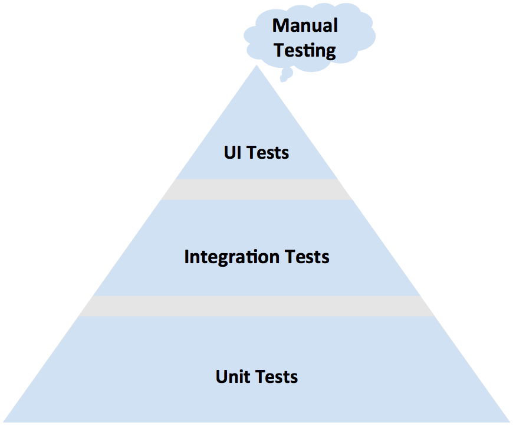

# Tasting tests at Cookpad
@Kazu_cocoa

^ 皆さんこんにちは。クックパッドでテストエンジニアをしています松尾です。SwiftやiOSに関係する人たちの集いで発表することができ、とても緊張しています。
^ 私はテストエンジニアなので、今日の話はテストにまつわるものになります。私は料理にもかかわる会社に属しているので、タイトルはtastingとしてみました。

# About me

- Name: Kazuaki Matsuo
- Company: Cookpad .Inc
- Role: Test Engineer / Software Engineer in Quality
- Lang: Swift/ObjC/Java(for Android)/Ruby/Elixir
- maintain: Appium ruby-binding

^ まず自己紹介です。
^ 私は普段はモバイルアプリのテスト自動化やプロセス改善、もっと大きく組織的な改善活動にも関わっています。
^ 普段の活動はテストだけではないので、Software Engineer in Qualityと呼べるような品質に対していろいろな取り組みを行う、幅広い働き方かもしれません。
^ 開発言語としてはSwiftなどの他にはRuby/Elixir/Java for Androidに触れることが多いです。
^ 少し前から、AppiumのRuby bindingをメンテナンスしています。Appiumはモバイルアプリ向けのツールなので、もしかしたらこの会場に来ている人の中にはライブラリを使ってくれた方がいるかもしれません。

# Tests?
^ 一言でテスト、といっても、いくつか種類があります。
^ Usually, "test" include a bunch of types.

^ 例えば、usability testやperformanceテストといったカテゴリの話があったり、unit test/integration testといったテストレベルの話であったり。
^ 今日は、テストピラミッドと呼ばれるunit testやintegration test、UI testと区分される話に焦点を当てて話をします。

# Based on test pyramid

^ このピラミッドは目にすることが多いかもしれません。
^ 実施するテストレベルと、その量がどのような関係にあると理想的か、ということを表した図です。
^ いわゆるメソッド単位でのロジックの確認を中心とするunit testから、Viewを操作する、ユーザの操作を模倣するようなUI Testまで存在しています。

# How UI Tests support our product
^ どれだけUI Testが私たちの開発を支えたか

^ 今日はこの中でUI Testが何を支えるか、をtastingしてみようと思います。
^ これの結果、UI Testの価値やそこへの取り組みのモチベーションにつながれば嬉しいです。

# テストの話はテスト対象をのけ者にはできない

^ ところで、ツール以上のテストの話をする時、そのテスト対象となる製品の話をのけ者にすることはできません。
^ そのため、少しCookpadについて話し、今回テスト対象となるiOSアプリがどんなものかを味わっていきます。

# What is Cookpad?

cookpad.com/us と cookpad.com/jp のWebページを1つの画面に並列でのせる

^ Cookpadはレシピ共有サービスを提供しています。始まりはWebサービスからでした。
^ 現在は日本向けのものと、日本以外に向けたものを提供しています。これは、Webサービスの成熟度の違いからきていますが、いずれも同じcookpadです。

# Cookpad for the world
https://www.similarweb.com/top-websites/category/food-and-drink/cooking-and-recipes

^ 最近では海外でもシェアを広げ、simularweb.comではfoodカテゴリで最大のものとなっています。

# Cookpad for iOS(Japan and Global)

日本のスクショと、海外向けのスクショを載せる

^ クックパッドの主なiOSアプリには2種類あります。それは日本向けのアプリと、日本以外に向けたアプリです。
^ 国外からいらっしゃった方は、この海外向けのものをよく見るとおもいます。
^ 今日は、この日本向けのアプリを対象に話します。

# History for Cookpad iOS App

- クックパッドアプリの遷移
- (図)横軸を時間とした、cookpadアプリのUIの遷移を乗せ、現在のtopを表示する

^ このクックパッドアプリはすでに5年の時を経ています。その間、UIを複数回大きく変えました。
^ 2013年に大きくアプリを作り変え、2014年にUIをiOS6の頃から変更し、2015年にはiOS8?7?向けに変更しました。
^ このように、見た目も変えながら、最近では中身も最近ではSwiftへと置き換えを進めています。<= もしかしたら、最近のSwiftのコードの%を載せるかも
^ ソースコードも順調に増え、今では10万行ものコードが存在します。

# History for UI Tests

- github repositoryのグラフを載せる

^ 2014年の頃からUI Tests、特にAppiumを使った環境を作っていきました
^ 現在、すでに2017年になりますが、その当時からのツールを今も発展させながら使い続けています
^ この間、先ほど見せたようにUIを変化させながらも、このテストコードの拡充とマニュアルテストによって変化を支えてきました。

# Quality in Japan

^ 今回のiOSアプリが対象とする国は主には日本です。そこで、日本のアプリに対する見方を少し共有します。

# kano-model based quality

kano-modelを表示する

^ 比較的見やすい品質モデルにkano-modelがあります。このモデルには当たり前品質を魅力的品質の2種類があります。
^ 日本では、この当たり前品質の要求が高く、特に基本的な機能が動作すること、例えば画面遷移ではクラッシュしないことなどの要求が高いです。
^ 日本では、基本的な機能以外にも画面遷移の多くが不具合なく動く事が期待されることが多い。
^ そういうことが当たり前、と感じる人が多い傾向にあるようです。(cookpadのレビューと不具合を参考にすると)

- 何か参考資料持ってこれたらな...

# Quality in Mobile

Diachronic Quality

^ diachronic qualityという造語があります。
^ これは、変わり続ける品質を説明するものです。言語学から影響を受けています。
^ モバイルアプリ、特にサービスとして提供しているアプリは時代の流れに合わせて変化が大きくなるので、この変化し続ける世界においても、先ほど挙げた日本のユーザが当たり前だと感じる明らかな不具合を減らす必要があります。

# Change, Change, Change...

^ iOS周りの変化を説明
^ iOS6, 7, 8...
^ Objective-C, Swift!!
^ プラットフォームの変化に合わせて、時代によって求められるQualtyも変化していってます

# Changes in Cookpad

^ この間、この時代に沿ったり、Cookpad独自に変化しようとするように、cookpadにおける"変化"を詳しく見てみると、このように細かく、頻繁に変化しています

# Cookpad's release cycle
- 2week ~ 1month release sycle
- Change UI / Code many times since Apple require us change

^ その間、私たちのアプリは、2週間〜1か月のスパンでここ2年間リリースを続けています。

# ここまでで話したこと

- Cookpadアプリの変化の遷移
- 日本における、アプリの動作で基本的なものとして求められること
- モバイルアプリは特に、変化し続けることが必要な品質

# ビジネスへの挑戦からアプリの安定 - Re-Engineering

サービスはビジネスへの挑戦の為に、試行錯誤します。 <= 試行錯誤の段階

^ ユーザ数、規模が大きくなるにつれて環境の整備やre-write/re-factorを行う必要が出てきました

# Re-Write/Re-Factor - Re-Engineering

> unit testが大事であることは、疑いようはない
> Unit tests are not a silver bullet.

^ 最近出たre-engineeringにあるように、現在だと単体テストを書くとか、そこらへんは必要だという認識を多くの人が持っていることと思います。
^ また、Swiftだとtypeをしっかり使うことやunit testやそのCI環境が基軸となることは最近では多くの人が納得することでしょう。
^ ただ、5年とか前のアプリにおいて、十分にテストコードが書かれたものは少ないのではないでしょうか。

# UI Test to support Re-Engineering

> One area that cries out for automation is UI testing.
> (4.3.2. Regression testing without unit tests)

^ また、Re-Engineeringにはこのようなことも書かれているように、まさしく、UI Testこそ、変化に追従し、変化に追従するに当たって大事な要素になります。
^ UIやシナリオの設計(体験の設計)が差別的な競争力になるモバイルアプリではなお。
^ iOSでは、最近のSwiftへの置き換えも進めるように、UIレベル、つまりユーザが目にする範囲において確実に動作することが確認出来る環境を持っていることは大きな優位性になります。
^ 社内で働くiOSエンジニアの多くも、自分の実装によって自分の想定していない不具合も表示されるものは特に、検出される可能性が高いことは心理的安全性にもつながります。
^ 実装の書き換えに怯えなくて良くなりますね。

# Automated UI Test with Appium from 2014

^ この問題に対して、私は2014年よりAppiumを中心としたUIテストを強化してきました。言語は表現力や会社の主要言語の関係でRubyをベースにしています。
^ マニュアルテストだけのテスト要員はおらず、基本的にはこのUIテストによる多くのiOSのバリエーションに対するテストでテストを続けきました。
^ 自動化されたテストは、多くの場合は3回以上実行すると元が取れるといわれます。(要出典)

# Architecture for UI Tests

|シナリオ| <=> ｜操作の実装｜ <=> internal libraries <=> ruby_lib <=> Appium <=> Cookpad App

^ このUIテストの大きなアーキテクチャはこのようになっています。
^ このおおまかな形は2014年から変わることなく続いています。
^ これは、クックパッドアプリとしての独自ドメインであるシナリオと、AppiumやiOSの環境といった実際の環境を分離している状態です。
^ Webアプリに触れたことがある人はわかるかもしれませんが、Cucmberを使う時の構造に似ていますね。また、責務の分離はエンジニアに取っても馴染みの深いものかと思います。

link: http://www.slideshare.net/KazuMatsu/20141018-selenium-appiumcookpad

# Image Diff

^ 途中から、このようにimage diffも撮るようになりました。これは結果のジャッジメントを自動化することのほか、デザイナーへのフィードバックとしても利用されます。

# Re-Engineering - re-write / re-factor withgout fear for developers

^ このような環境を作ることにより、開発者が自信を持って内部コードを書き換え、変更することができるようになります。
^ 複雑な仕組みを書き換えながらも、そのユーザへの影響などはUI Testにより8割、9割はカバーされる状態になります。

# Re-Engineering - jump up to Swift

^ 私たちのアプリでは、ここ最近Swiftへの置き換えが進んでいます。
^ この書き換えに対しても、このUIに対する自動化されたテストは大いに役立ちます。
^ 加えて、途中から私たちがリクエストのキャプチャも計測し始めたので、外から見たアプリの振る舞いに対しては、View/Networkの2つの面から自動化されたテストである程度カバーできる状態になっていました

# Wrap up

- 自動化されたUI Testsのアーキテクチャと、それらはRe-Engineeringを支えること
- include UI Testsはデザイナも含んだフィードバックサイクルを回す手助けとなる
- 環境の変化の大きなモバイルアプリにおいては、どの程度細かくテストを書き、どの程度テストを書かずにUI Testsに任せるかが大事になる

^ どこに大きく変化が訪れ、それに対してどのように対策していくか。
^ 私たちの場合は、長く続くサービス、変化を続けるアプリや内部コードに対して、UIテストがもたらす恩恵をお話ししました。

# Tips for UI Tests

^ ここまでコードの話をしませんでしたが、tipsを少し。
^ 皆さんもお使いかもしれませんが、表示の変化に追従するためにaccessibilityIdentifierをうまく使いましょう。
^ Xcode8からはStoryboardにおいても簡単に設定できるようになりました。
^ コードへの知見がなくとも、Storybardを触ることができるのであれば用意にidを付与できます。
^ Viewが置き換わらない限り、座標の変更程度であればaccessibilityIdentifierを中心に記述されたUIテストは壊れることはあまりありません。

# manual testers

^ ちなみに、私たちの組織にはマニュアルテストだけを行う人はいません。
^ checkするためのテストは多くを自動化し、人の想像力によってtestする領域を増やそうとしています。

# future

^ モバイルアプリのテスト環境はまだ変化を続けています。
^ XCUITestの登場やEalrGrey
^ FBSimulatorControllerやWebDriverAgentなど。
^ 多くのとても有用なツールが少し前から顔を出し、成長して行っています。
^ Swiftなども変化の波に当面の間のるでしょう。

# Thanks

同僚のicons + Thanks

^ 最後に、この会場にも来ている私の同僚の方々にもありがとう
