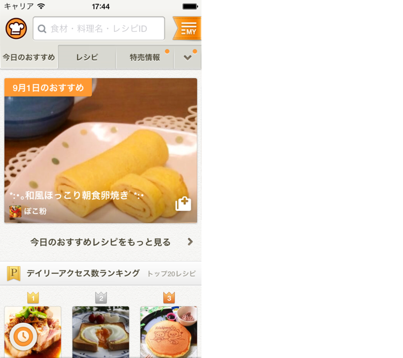

# Tasting tests at Cookpad
@Kazu_cocoa

Hello everyone.
I'm Kazu.
Now, I'm so happy and exciting to be able to talk for many Swift and iOS develpers.

Today's my topic is associated with "TEST" since I'm test engineer at Cookpad.
"Tasting" used in my title means taste food stuff because my company is regarding with food.

# About me

First, I talk myself.
I'm kazuaki matsuo and working at Cookpad as test engineer.
I've tried test automation for Android and iOS, and improved development processes and other many role to imprpve quality.
So, "Software Engineer in Quality" might be more suitable name than test engineer in my company, I think.

I use some languages in my work such as swift, ruby, java for android and elixir.
Recently, I've maintained ruby binding client library for Appium.

# 😋
go ahead

# A bunch of topics in "TEST"
Even we use the word "TEST", it has various topics.

For example, the word has categories such as usability test and performance test, and has test level such as unit test and integration test.
Today, I pick up a test pyramid which has three layers, unit test, integration test and ui test for automated test and manual test.

# test pyramid
This pyramid is one of famous figure for test automation.
The pyramid means ideal relationship and amount between unit tests, integration tests and UI tests in development.
Unit tests deal with testing logic in code level and ui tests focus on simulate user behaviours against test target app.

# How UI Tests support our development
Today, you can tast UI tests and its our story.
I'm happy if anyone has motivation to try ui tests after my talk.

Meanwhile, I don't talk topick about unit test level.

# We should know about the test target if we tast tests
(いまいち...)

We should learn test target if we tast test not only about tools but also strategies.
So, I'll explain about Cookpad and its iOS app at first to help you understand the following topics.

# What is Cookpad?

Cookpad is one of famous recipe sharing service in the world.
We have two kind of the service, for Japan and for rest of the world for now.
According to the similarweb.com, Cookpad is the largest site in food category.

# Cookpad for iOS(Japan and Global)

We also have two kind of iOS applications.
One is for Japan and another is for rest of the world.
They are difference service growth level, so we have't merge them yet.

Anyone comes from out of Japan, can see global app.

# Cookpad for iOS(Japan)

I focus on japanese app today.

# History for Cookpad iOS App

The cookpad app have grown for around 5 years.
I attched some screenshots to be able to check the change.
The app changed UI component/features many times during the period.
In addition, the app changes not only UI but also internal logic, implementatins.
(ここ、いまいち)
Sorce code also have grown and it is around 100 thousand lines except for comment, balnk lines for now.

# Quality in Japan market

