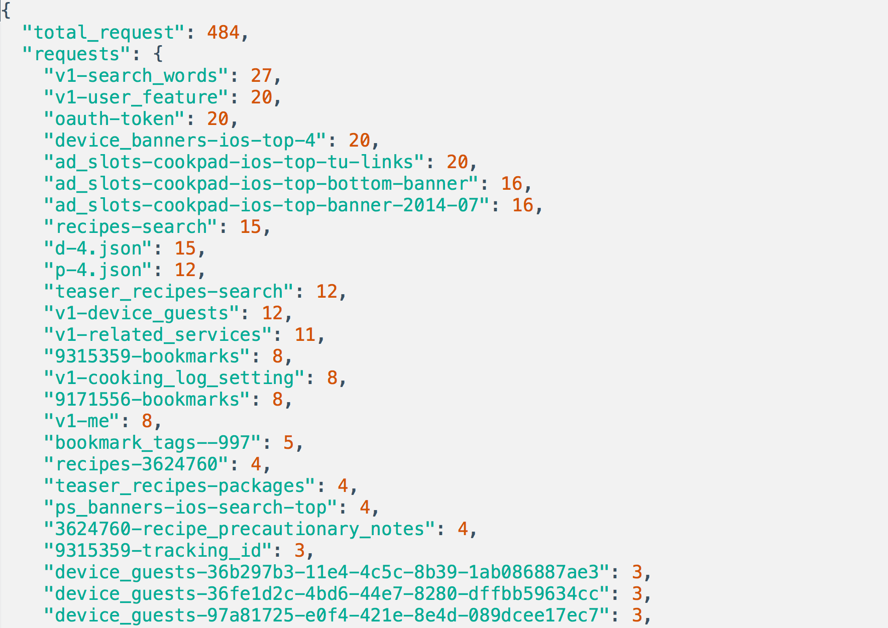

# Tasting tests at Cookpad
`@Kazu_cocoa`

^ 皆さんこんにちは。クックパッドでテストエンジニアをしています松尾です。今日はSwiftやiOSに関係する人たちの集いで発表することができ、とても嬉しいですし、興奮しています。
^ 私はテストエンジニアなので、今日の話はテストにまつわるものになります。
^ ちなみに、このタイトルは私は料理にもかかわる会社に属しているのでtastingとしてみました。

# About me

- Name: Kazuaki Matsuo
- Company: Cookpad .Inc
- Role: Test Engineer / Software Engineer in Quality
- Dev: :swift: / :ruby: / :java: for  :android: / :elixir: :erlang:
- maintain: Appium ruby-binding


^ まず自己紹介です。
^ 私は普段はモバイルアプリのテスト自動化やプロセス改善、もっと大きく組織的な改善活動にも関わっています。
^ 普段の活動はテストだけではないので、Software Engineer in Qualityと呼べるような品質に対していろいろな取り組みを行う、幅広い働き方かもしれません。
^ 開発言語としてはSwiftなどの他にはRuby/Elixir/Java for Androidに触れることが多いです。
^ 少し前から、AppiumのRuby bindingをメンテナンスしています。

# 😋

# A bunch of topics in tests
^ 一言でテスト、といっても、様々なテーマがあります。
^ Usually, "test" include a bunch of types.

^ 例えば、usability testやperformanceテストといったカテゴリの話があったり、unit test/integration testといったテストレベルの話であったり。
^ それらの中で、今日はテストピラミッドと呼ばれるunit testやintegration test、UI testと区分されるテーマに関してお話をします。

# test pyramid


- http://www.utest.com/articles/mobile-test-pyramid

^ このピラミッドを目にしたことがある人は多いかもしれません。
^ 実施するunit test/integration test/ui testの量がどのような関係にあると理想的か、ということを表した図です。
^ 多くの場合、unit testはメソッド単位のテスト、UI testがユーザの操作を模倣するような粒度での話になります。

# Today's topic: How UI Tests support our development
^ どれだけUI Testが私たちの開発を支えたか

^ 今日はこの中でUI Testが私たちの何を支えたのか、をtastingしてみようと思います。
^ これの結果、UI Testの価値やそこへの取り組みのモチベーションにつながれば嬉しいです。
^ Siwftによるunit testレベルの話は他の発表があるようなのでそちらを楽しみにしてください。

# テストの話はテスト対象をのけ者にはできない 🙅

^ ツール以上のテストの話をする時、そのテスト対象となる製品の話をのけ者にすることはできません。
^ そのため、少しCookpadについて話し、今回テスト対象となるiOSアプリがどんなものかを味わってみます。

# What is Cookpad?


https://www.similarweb.com/top-websites/category/food-and-drink/cooking-and-recipes

^ Cookpadはレシピ共有サービスを提供しています。始まりはWebサービスからでした。
^ 現在は日本向けのものと、日本以外に向けたものを提供しています。これは、Webサービスの成熟度の違いからきていますが、いずれも同じcookpadです。
^ 最近では海外でもシェアを広げ、simularweb.comではfoodカテゴリで最大のものとなっています。

# Cookpad for iOS(Japan and Global)


^ クックパッドの主なiOSアプリには2種類あります。それは日本向けのアプリと、日本以外に向けたアプリです。
^ 国外からいらっしゃった方は、この海外向けのものをよく見るとおもいます。
^ 今日は、この日本向けのアプリを対象に話します。

# Cookpad for iOS(Japan)


^ ただ、今日は、この日本向けのアプリを対象に話します。

# History for Cookpad iOS App


^ このクックパッドアプリはすでに5年の時を経ています。その間、UIを複数回大きく変えました。
^ 2013年に大きくアプリを作り変え、2014年にUIをiOS6の頃から変更し、2015、16年と機能をいろいろ追加したり、除いたりしながら試行錯誤してきました。
^ 見た目も変えるのですが、例えば中身もSwiftへと置き換えを進めているように多くのre-write/refactorをコードレベルでも加えています。
^ ソースコードも順調に増え、今では10万行ものコードが存在します。

# kano-model and Japan market


https://en.wikipedia.org/wiki/Kano_model

^ 比較的見やすい品質モデルにkano-modelがあります。このモデルには当たり前品質を魅力的品質の2種類があります。
^ 日本では、この当たり前品質の要求として特に基本的な機能が動作すること、例えば画面遷移ではクラッシュしないことなどの要求が高いです。
^ そのため、そういうことが当たり前と感じる人が多い傾向にあるようです。(cookpadのレビューと不具合を参考にすると)

# Diachronic Quality in Mobile App

^ diachronic qualityという造語があります。
^ これは、変わり続ける品質を説明しようとしていることばです。言語学から影響を受けています。
^ モバイルアプリ、特にサービスとして提供しているアプリは時代の流れに合わせて変化が大きくなるので、この変化し続ける世界においても、先ほど挙げた日本のユーザが当たり前だと感じる明らかな不具合を減らす必要があります。
^ 例えば、iOSだとOSの変化やUIの変化、実装言語の変化といった品質に関わる要素が毎年といっていいほどに変わります。

# Changes in Cookpad

- サービス拡大のための挑戦
    - Change UIs, features...
- 2week ~ 1month release cycle
- Change UI / Code many times since Apple require us change

^ この間、この時代に沿ったり、Cookpad独自に変化しようとするように、cookpadにおける"変化"を詳しく見てみると、このように細かく、頻繁に変化しています
^ その間、私たちのアプリは、2週間〜1か月のスパンでここ2年間リリースを続けています。
^ 最近では、1回のリリースには5,000~10,000行程度の変更が加わりながらリリースされています。

# ここまでで話したこと

- Cookpadアプリの変化の歴史
- 日本市場が求めるもの
- モバイルアプリをとりまく変化し続ける品質

^ 10分くらいにしておきたい

# Tasting tests😋

^ では、この環境の中で行ってきたUI Testの話をしていきたいと思います。

# History for UI Tests against Cookpad iOS App


^ このgithubリポジトリは、automated ui testのツール群の成長の軌跡です。
^ 2014年の頃からUI Tests、特にAppiumを使った環境を作っていきました。
^ この間、先ほどのiOSアプリの変化の歴史をこの自動化されたテストによって支えてきました。

# なぜここまでUI Testになぜ力を入れていたか🤔

# Re-Engineeringを進める

何か良い画像を埋め込みたい...

^ クックパッドアプリは、今ではシェアを多く持っていますが、以前は試行錯誤が中心でした。
^ そこから、UIを整えたり、機能を整えたり、開発人数が増えた上でもそれを維持する仕組みが必要になってきました。
^ そのため、re-writeやrefactorを推し進め、継続して開発を続ける体制を作る必要がありました

# どこからテストを拡充していくか?

> Writing unit tests before refactoring is sometimes impossible and often pointless.

^ rewriteやリファクタを推し進める時、高頻度でテストが行われ、それを元に正しいことを確認し続ける環境を持つことは最近では必要だと知っている人が多いでしょう
^ ただ、例えばunit testに近い、コードに近い領域をいきなりテストし始めることは難しいです
^ どのようにアプリのアーキテクチャを構成するか、にも大きく依存してきます。
^ 一方で、unit testのテストをCIとして実施できるようにしなければ、高頻度の修正を将来に渡って実施し続けることは難しい

# Basic strategy for Re-Engineering

^ そこで、まずはテスト対象のアプリを、内部、外部の2つの側面から見ます
^ 内部、とはユーザには見えないソースコードレベルの話です
^ 外部、とはユーザに見えるようなUIが関わる領域の話です

# 内部を変更できるようにするために、外部からカバーしていく

1. コードの内部を変更することができるように、UIの、コードとは独立したところでテストを用意する
2. そのレベルで動作を確認できるようにしながら、内部コードを変更できるようにしていく

# Unit tests for Re-Engineering

> Most developers would agree that unit test should be fully automated,

^ 最近出たre-engineeringにあるように、現在だと単体テストを書くとか、そこらへんは必要だという認識を多くの人が持っていることと思います。
^ また、Swiftだとtypeをしっかり使うことやunit testやそのCI環境が基軸となることは最近では多くの人が納得することでしょう。
^ ただ、5年とか前のアプリにおいて、十分にテストコードが書かれたものは少ないのではないでしょうか。

# Unit tests are not a silver bullet

> but the level of automation for other kind of tests(such as integration tests) is often much lower.

# UI Test to support Re-Engineering

> One area that cries out for automation is UI testing.
> (4.3.2. Regression testing without unit tests)

^ Re-Engineeringにはこのようなことも書かれているように、まさしく、UI Testこそ、変化に追従し、変化に追従するに当たって大事な要素になります。
^ UIやシナリオの設計(体験の設計)が差別的な競争力になるモバイルアプリではなお。
^ iOSでは、最近のSwiftへの置き換えも進めるように、UIレベル、つまりユーザが目にする範囲において確実に動作することが確認出来る環境を持っていることは大きな優位性になります。
^ 社内で働くiOSエンジニアの多くも、自分の実装によって自分の想定していない不具合も表示されるものは特に、検出される可能性が高いことは心理的安全性にもつながります。
^ 実装の書き換えに怯えなくて良くなりますね。

# Test environment for Mobile apps tend to be flipped pyramid easily


- http://www.utest.com/articles/mobile-test-pyramid

^ ところで、モバイルアプリはこのように理想的なピラミッドとは逆のピラミッドになりやすいです
^ そのため、Re-Engineeringを進めるための、特にUIに対するテストを自動化していくことは、理想的なピラミッドに近づけるにあたり大きな要素になります
^ そうすることで、様々なバリエーションの解像度やOSバリエーションに対するUIレベルのテストを、手動で網羅するよりも短時間で評価できます

# implement the strategy

# Automated UI Test with Appium from 2014

^ この問題に対して、私は2014年よりAppiumを中心としたUIテストを強化してきました。言語は表現力や会社の主要言語の関係でRubyをベースにしています。
^ マニュアルテストだけのテスト要員はおらず、基本的にはこのUIテストによる多くのiOSのバリエーションに対するテストでテストを続けきました。
^ 自動化されたテストは、多くの場合は3回以上実行すると元が取れるといわれます。(要出典)

# Architecture for UI Tests

|シナリオ| <=> ｜操作の実装｜ <=> internal libraries <=> ruby_lib <=> Appium <=> Cookpad App

^ このUIテストの大きなアーキテクチャはこのようになっています。
^ このおおまかな形は2014年から変わることなく続いています。
^ これは、クックパッドアプリとしての独自ドメインであるシナリオと、AppiumやiOSの環境といった実際の環境を分離している状態です。
^ Webアプリに触れたことがある人はわかるかもしれませんが、Cucumberを使う時の構造に似ていますね。また、責務の分離はエンジニアに取っても馴染みの深いものかと思います。

link: http://www.slideshare.net/KazuMatsu/20141018-selenium-appiumcookpad

# Scenarios

```ruby
機能: 複数の条件に合致する検索を正しく行うことができる
  背景:
    前提 'iPhone' で試験を行う

  シナリオアウトライン: ユーザは自分のログイン状態によって変化する検索結果を見ることができる
    * <user_status> ユーザでログインする
    * <search_words> と検索欄から検索する
    * 私は '3' 回下側にスクロールする
    * 画面に 'xxx' が表示されている

    例:
      | user_status | search_words  |
      | 'ps'        | 'ヤシガニ'     |
      | 'non-ps'    | '月食'        |
      | 'guests'    | 'カワエビ'     |
      | 'guest'     | 'テナガエビ'   |
```

^ 基本、シナリオレベルでは自然言語で、普段チームの人たちが使う言葉をベースにそうさを記述します。
^ これは、ユーザを模倣するシナリオを書く時にソースコードレベルの細かなことを書かないようにするためです。
^ そのような細かなものは、unit testなどに任せましょう。

# what kind of scenarios do we describe
^ シナリオを書く際、人を模倣すると言いましたが例えばspreadsheetなどで管理するようなテストケースをそのままシナリオに落とし込むわけではありません。
^ iOSアプリのテストでは、simulaltorの初期化や起動などに時間が必要なので、ある程度のシナリオをまとめて実行するようにしたりします。
^ また、人が繰り返しやるには大変な長いシナリオを実施させたりもします。
^ 例えばクライアントのキャッシュを超えた時間を待った後、ちゃんとViewが再描画されるか、というものも確認することがあります。

# Seasoning
^ 味付け

このUIテストを構築する上で必要な味付けをいくつか共有します

# Tips1: 内部コードから依存性を減らす

^ この手のUI Testで重要なのは、実装の内部コードの構造に強く依存しないようにすることです。
^ 依存性を増やすと、そのぶん内部コードの変更に対して手を加える必要があります。
^ 内部コードに依存したテストは良い面もありますが、今回の文脈において必要としているUI Testには適切ではありません

# Tips2: 環境変数によりテスト対象の挙動を帰る
^ 私たちはiOS Simulatorを主に使います。実機上では実行スピードの関係上、ほとんど使いません。
^ その時、スキーマを変えずとも何らかの挙動を制御したい場合、環境変数を指定します。
^ xcodebuildの話になるのですが、環境変数により挙動を変更することができると、設定によって必要以上にスキーマを増やすことをしなくて済みます

# Tips3: set accessibilityIdentifier with code/storyboard

^ UIAutomationを使っていたころはiOSがXPathによる要素選択をサポートしていました
^ Xcode7からは、Storyboard上でaccessibilityIdentifierを付与することもできるので、iOS8以上をサポートする場合はStoryboard上からViewだけに依存した形で管理、その結果を例えばCSVの一覧として管理すると良いでしょう。差分を追いやすくしておくと、変更に追従しやすくなります。

# tips4: データの境界値は網羅しない

^ なんらかの入力値のバリエーション網羅は、極力unit testに違い側で行うべきです。
^ 無数(a bunch of)の入力パターン全てをUI testで確認することは時間がかかるので避ける必要があります。
^ はじめのうちはui testで用意しても、refactorを続け、unit testが増えていくにつれて削除することは必要です。

# Tips5: 要素のタップベースでシナリオを書く

^ iOSのフレームワーク側の都合もあるのですが、XCUITestではある種のスクロールが不安定になります。そのため、そのような不安定な箇所を減らすことで、テスト自体の安定性をある程度確保していきます。
^ これはどこまでautomationに寄せるかという話なので、時と場合に依存しますね。

# more 🌶️




^ 途中から、このようにimage diffも撮るようになりました。これは結果のジャッジメントを自動化することのほか、デザイナーへのフィードバックとしても利用されます。

# Re-Engineering - re-write / re-factor without fear for developers

^ このような環境を作ることにより、開発者が自信を持って内部コードを書き換え、変更することができるようになります。
^ 複雑な仕組みを書き換えながらも、そのユーザへの影響などはUI Testにより8割、9割はカバーされる状態にしてきました。1年くらいの間はシナリオの調整を中心に行っている感じです。

# introduce Swift


^ ここ最近では、機能の追加や変更に加えて私たちのアプリでは、ここ最近Swiftへの置き換えが進んでいます。
^ この書き換えに対しても、このUIに対する自動化されたテストは大いに役立ちます。
^ サービスとして取得している体験を損ねることなく、内部ロジックをSwiftへ書き換えていく。
^ そのようなことを、image diffやnetwork request captureも含めて支援しています。

# faster and more stable

^ モバイルアプリのテスト環境はまだ変化を続けています。
^ XCUITestの登場やEalrGreyといったものも出てきています。
^ FBSimulatorControllerやWebDriverAgentなど。
^ 多くのとても有用なツールが少し前から顔を出し、成長して行っています。
^ Swiftなども変化の波に当面の間のるでしょう。

- 私たちも、より早く安定したautomation testを作りたい

# まとめ

- 自動化されたUI Testsのアーキテクチャと、それらはRe-Engineeringを支えること
- include UI Testsはデザイナも含んだフィードバックサイクルを回す手助けとなる
- 環境の変化の大きなモバイルアプリにおいては、どの程度細かくテストを書き、どの程度テストを書かずにUI Testsに任せるかが大事になる

^ ここまでで、私たちがre-engineeringを行っていくまでに用意したUI Testsの話を味わってみました。
^ また、最近ではそのre-engineeringはデザイナーと行ったチームみんなのへのフィードバックツールへとも役立っていること。

# Thanks

同僚のicons + Thanks

^ 最後に、この会場にも来ている私の同僚の方々にもありがとう
